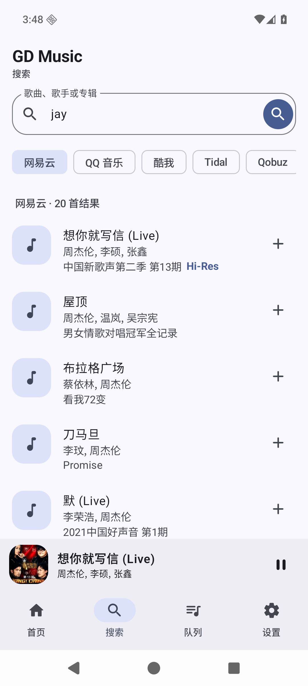

# GD Music Next

面向新 Android 设备重写的 GD Music 客户端。应用采用 Kotlin、Jetpack Compose Material 3 和 Media3，不再依赖旧版 AndroLua 容器；支持 10 个公开音乐源的搜索、在线串流、封面、歌词、喜欢、歌单、播放队列与后台播放。

> 本项目调用 GD 音乐台公开 API，仅供个人学习和测试。音乐与封面版权归各自权利人所有，请支持正版音乐；请勿将下载内容传播或商用。



## 快速安装

要求 Android 8.0（API 26）或更高版本，应用 ID 为 `com.gdstudio.music.next`，可与旧版并存。日常使用建议安装体积更小的 [`Release Preview`](dist/gdmusic-next-2.7.1-release-preview.apk)；需要连接 Android Studio、查看详细日志时使用 [`Debug`](dist/gdmusic-next-2.7.1-debug.apk)。

通过 ADB 安装：

```powershell
adb install -r .\dist\gdmusic-next-2.7.1-release-preview.apk
```

APK SHA-256：

```text
Release Preview: 33539D1B549C26449CF0D91387E17B3BC2AB548E99EC38EE914B5276F3CB20AE
Debug:           A62B2DC17C8503DA7ADBDF979D4FCB27828892C3D41F0AB0E487E95B25785175
```

## 构建与验证

准备 JDK 17 和 Android SDK 36，然后在项目根目录执行：

```powershell
.\gradlew.bat lintDebug testDebugUnitTest assembleDebug
```

本次交付使用 AGP 8.13.2、Gradle 8.14.3、Kotlin 2.3.20、Compose BOM 2026.04.01，目标 API 36。

### 构建版本

- **Debug**：便于开发调试，适合模拟器和日常验证。
- **Release Preview**：启用 R8 压缩和资源收缩，适合实际体验测试；目前使用 Debug 签名使其可直接安装，公开商店发布前必须替换为私有 Release keystore。

```powershell
.\gradlew.bat assembleDebug assembleRelease
```

## 功能

- 网易云、QQ 音乐、酷我、Tidal、Qobuz、JOOX、B 站、Apple Music、YouTube Music、Spotify 搜索
- 128 / 192 / 320 / 740 / 999 五档请求音质
- 在线播放、封面、LRC 歌词、队列和迷你播放器
- 顺序播放、列表循环、单曲循环、随机播放及模式持久化
- 本地“我喜欢”、自建歌单、歌曲去重与跨重启持久化
- 播放历史、冷启动继续播放、队列排序/清空/下一首播放、歌单改名
- 精确恢复播放位置、0.5×–2× 倍速、本地音乐 MediaStore 扫描与播放
- 实用型首页入口、浅色/深色模式、莫奈动态取色与自定义种子色
- 单曲/批量下载、进度通知、封面与歌词标签写入
- 音源显隐、优先级排序，以及解析失败时按启用顺序自动回退
- Media3 后台播放、媒体通知与锁屏控制
- Material 3 动态配色、深色模式、边到边显示和大屏内容限宽
- 最小权限：仅网络及媒体播放前台服务权限；无存储、定位或无障碍权限

## 架构与维护边界

应用 UI、状态、网络、下载和播放器均为原生实现。客户端通过 OkHttp 调用 `https://music-api.gdstudio.xyz/api.php` 的公开 GET API，不再加载官网签名脚本或使用隐藏 WebView；音频由 Media3 后台服务播放。

主要代码：

- `app/src/main/java/com/gdstudio/music/next/data/GdMusicApi.kt`：公开 API 客户端
- `app/src/main/java/com/gdstudio/music/next/data/SourcePreferences.kt`：音源显隐与优先级持久化
- `app/src/main/java/com/gdstudio/music/next/data/LibraryRepository.kt`：本地喜欢与歌单持久化
- `app/src/main/java/com/gdstudio/music/next/playback/PlaybackService.kt`：后台播放器
- `app/src/main/java/com/gdstudio/music/next/ui/GdMusicApp.kt`：Material 3 界面

完整逆向依据、证据链与调用路径见 [`docs/2026-08-28_reverse-gdmusic-report.md`](docs/2026-08-28_reverse-gdmusic-report.md)。
md3Music 收藏与歌单的 clean-room 结构迁移见 [`docs/2026-08-29_md3music-library-migration-report.md`](docs/2026-08-29_md3music-library-migration-report.md)。
与 md3Music 的功能差距和后续优先级见 [`docs/2026-08-29_md3music-feature-gap.md`](docs/2026-08-29_md3music-feature-gap.md)。

## 已知限制

- 官方接口当前公告的稳定源为网易云、JOOX、B站；其他源可能只支持搜索或暂未开放。
- 公开 API 限制为 5 分钟不超过 50 次请求；自动回退也会计入次数。
- 音源可用性、曲目音质和地区限制由上游服务决定并可能动态变化。
- Release Preview 已启用代码与资源压缩，但为了便于直接安装仍使用 Debug 签名；公开商店发布前应配置自己的 Release keystore，并核对第三方接口及内容授权。
