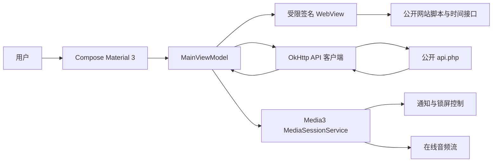

# GD Music APK 与网站逆向适配报告

> 分析日期：2026-08-28<br>
> 报告类型：普通 APK / Web 接口逆向，`flavor = null`<br>
> 工具链：JADX、apktool、Playwright、ADB、Android Lint、Gradle

## 执行摘要

本次在用户授权范围内分析了旧版 GD Music APK 与其公开网站，并据此完成了全新的原生 Android 客户端。旧 APK 是目标 API 23 的 AndroLua/FusionApp 容器，包含常驻、旧存储、明文流量和无障碍服务等不适合现代 Android 的配置；新版本没有迁移这些机制，而是采用 API 36、Compose Material 3、OkHttp 与 Media3。网站搜索、播放地址、封面和歌词接口可由原生客户端调用，但请求签名依赖官网脚本、当前主机和同步时间请求，所以保留了一个最小、不可见且无原生桥的 WebView 作为兼容边界。API 36 模拟器已完成冷启动、真实搜索和在线播放验证。

## 范围与目标

授权、资产和网络边界记录在 [`scope.md`](../work/gdmusic-modernization/scope.md)。分析仅覆盖用户提供的 APK 和公开网站正常访问；拒绝服务、真实用户钓鱼和不受限数据导出明确不在范围内。

目标是回答三个问题：

1. 旧客户端为何不适合新 Android，哪些机制不应复用？
2. 公开网站的搜索与播放数据流如何工作？
3. 如何用长期可维护的原生架构实现 Material 3 新客户端？

## 静态与动态分析

旧 APK 基本信息：

| 属性 | 值 |
|---|---|
| 文件 | `gdmusic.apk` |
| 大小 | 1,477,664 bytes |
| SHA-256 | `3597F7BDC97B36E2DA8562FAB4B384122C12A774BAAEA5E8EB910BA58DB2D6A9` |
| 包名 | `com.gdstudio.music` |
| 版本 | 1.1 |
| SDK | min 21 / target 23 |
| 入口 | `com.androlua.Welcome` |

JADX 和 apktool 解码结果表明，旧包以 AndroLua/FusionApp 为宿主，业务资产经过编译或封装。Manifest 还声明了常驻应用、旧式外部存储、明文流量、大堆和无障碍服务。它们不是音乐检索和播放所必需，因此新客户端不继承这些权限与生命周期策略。

对公开网站的浏览器网络观察确认：搜索向 `/api.php` 发送表单字段 `types=search`、`source`、`pages`、`count`、`name` 和签名 `s`；播放阶段再分别请求 `types=url`、`pic` 和 `lyric`。站点提供 10 个音乐源与五档音质。名为 `crc32` 的签名函数并非标准 CRC32，且会读取当前主机并同步调用时间接口，直接复制为纯 Kotlin 算法会把频繁变化的站点逻辑固化进客户端。

## 新版本设计



图中 WebView 只执行官网签名函数：JavaScript 可用，但 DOM 存储、文件访问、内容访问和自动开窗均关闭，且没有 `addJavascriptInterface`。界面不是网页包装器。搜索结果解析、并发解析播放地址/封面/歌词、队列与 LRC 均为原生实现；MediaSessionService 保证应用退到后台后仍能按平台规范播放。

工具链选择遵循当前兼容矩阵：AGP 8.13.2、Gradle 8.14.3、Kotlin 2.3.20、JDK 17、compile/target SDK 36 与 Compose BOM 2026.04.01。新包 ID 为 `com.gdstudio.music.next`，避免覆盖和污染旧版数据。

## Evidence

| E-id | source_ref | repro_command | content_hash |
|---|---|---|---|
| E-001 | [`E-001.md`](../work/gdmusic-modernization/evidence/E-001.md) | `Get-FileHash ...gdmusic.apk -Algorithm SHA256` | n/a（样本未复制进 case） |
| E-002 | [`E-002.md`](../work/gdmusic-modernization/evidence/E-002.md) | JADX/apktool 解码与 Manifest 检查 | n/a |
| E-003 | [`E-003.md`](../work/gdmusic-modernization/evidence/E-003.md) | Playwright 观察公开站点请求 | `48AF9535...314713` |
| E-004 | [`E-004.md`](../work/gdmusic-modernization/evidence/E-004.md) | ADB 安装、搜索、播放及媒体会话检查 | `A6D4B36B...E0F783` |
| E-005 | [`E-005.md`](../work/gdmusic-modernization/evidence/E-005.md) | `gradlew lintDebug testDebugUnitTest assembleDebug` | `66960E48...5D13C5` |

## Findings

### F-001

- title: 旧 APK 的运行时与平台配置不适合作为现代客户端基础
- severity: n/a_re
- category: design
- status: validated
- evidence_ids: [E-001, E-002]
- location: `AndroidManifest.xml`, `com.androlua.Welcome`, Lua assets
- impact: 直接修补会继续携带旧目标 SDK、过宽权限和不可维护的脚本宿主边界。
- confidence: high
- repro_steps: 解码 APK，检查 SDK、入口、组件、权限及资产类型。
- remediation: 采用新的原生工程，仅迁移经公开接口验证的产品行为。

### F-002

- title: 网站 API 可原生调用，但签名必须保留网页运行时兼容边界
- severity: n/a_re
- category: reverse_algo
- status: validated
- evidence_ids: [E-003, E-004]
- location: `/api.php`, website `crc32()`
- impact: 纯原生硬编码签名容易随官网脚本更新失效；整页 WebView 包装则牺牲原生体验与安全边界。
- confidence: high
- repro_steps: 浏览器捕获一次搜索请求；在新客户端使用同一站点签名后执行真实搜索。
- remediation: 隔离不可见 WebView，只求签名，其余逻辑保持原生并对 401 给出升级提示。

### F-003

- title: 原生 Material 3 客户端在 API 36 上完成搜索和后台播放闭环
- severity: n/a_re
- category: other
- status: validated
- evidence_ids: [E-004, E-005]
- location: `app/src/main/java/com/gdstudio/music/next`
- impact: 已实现可继续维护的最小端到端版本，并满足新 Android 的媒体与权限模型。
- confidence: high
- repro_steps: 构建并安装 Debug APK，搜索 `jay`，点击首条结果，检查 MediaSession 为 `PLAYING`。
- remediation: n/a

## Path

### P-001

- title: 从搜索关键词到后台播放的调用路径
- path_type: callflow
- start: 用户在 Compose 搜索框提交关键词
- goal: Media3 在后台播放解析后的在线音频
- steps:
  1. action: `MainViewModel` 请求 `WebsiteSignatureProvider` 生成滚动签名 — evidence: E-003 — finding: F-002
  2. action: `GdMusicApi` 用 OkHttp 请求公开搜索接口并解析曲目 — evidence: E-004 — finding: F-002
  3. action: 播放时并发解析 url、pic、lyric — evidence: E-004 — finding: F-003
  4. action: `PlaybackService` 把 MediaItem 交给 ExoPlayer，并暴露媒体会话 — evidence: E-004 — finding: F-003
- residual_risks: 第三方签名、接口、音源可用性和地区策略均可能变化；发布方需持续做回归测试并确认内容授权。

## 验证结果

| 检查 | 结果 |
|---|---|
| `testDebugUnitTest` | 通过，覆盖 LRC 和 API JSON 解析 |
| `lintDebug` | 通过；0 errors，15 条版本/依赖等建议性 warning |
| `assembleDebug` | 通过 |
| `assembleRelease` | 通过，R8 与资源压缩成功；产物未签名 |
| API 36 冷启动 | 通过，`LaunchState: COLD` |
| 真实搜索 | 通过，网易云返回 20 条结果 |
| 在线播放 | 通过，MediaSession 状态 `PLAYING` |
| 崩溃检查 | 未发现 `FATAL EXCEPTION` |

截图证据位于 [`work/gdmusic-modernization/evidence`](../work/gdmusic-modernization/evidence/)，最终 Debug APK 位于 [`dist/gdmusic-next-2.0.0-debug.apk`](../dist/gdmusic-next-2.0.0-debug.apk)。

## 复现命令与遗留风险

```powershell
.\gradlew.bat lintDebug testDebugUnitTest assembleDebug
adb install -r .\app\build\outputs\apk\debug\app-debug.apk
adb shell am start -W -n com.gdstudio.music.next/.MainActivity
adb shell dumpsys media_session
```

遗留风险主要来自第三方服务而非本地实现：官网滚动签名或请求字段变化会影响搜索；部分曲目可能因音源、地区或版权策略无法播放。公开发布还需配置 release 签名、制定隐私说明，并重新核对官网 API 与音乐内容的授权条款。

关键阶段记录见 [`timeline.md`](../work/gdmusic-modernization/timeline.md)。
